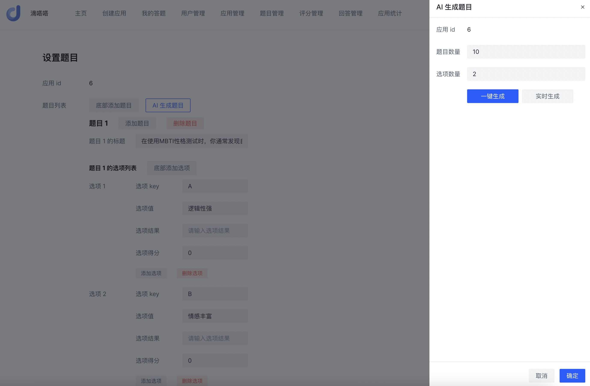

# 滴答 AI 答题应用平台

## 项目介绍

### 简介

- 用户基于 AI 快速创建并发布答题应用，例如 MBTI 性格测试。
- 平台支持检索、分享、在线答题，并基于 AI 得到回答总结。
- 用户可通过统计分析功能查看热门应用和用户结果分布。
- 管理员可以集中管理和审核应用。

> 已部署上线，在线访问地址：https://didada-inner.vercel.app/
>
> 管理员账号：jiandong，密码：12345678

## 技术选型与架构设计

### 前端技术栈

- Vue 3
- Vue-CLI 脚手架
- Pinia 状态管理
- Axios 请求库
- Arco Design 组件库
- 前端工程化：ESLint + Prettier + TypeScript
- 富文本编辑器
- QRCode.js 二维码生成
- OpenAPI 前端代码生成

### 后端技术栈

- Java Spring Boot 开发框架（万用后端模板）
- 存储层：MySQL 数据库 + Redis 缓存 + 腾讯云 COS 对象存储
- MyBatis-Plus 及 MyBatis X 自动生成
- Redission 分布式锁
- Caffeine 本地缓存
- 基于 ChatGLM 大模型实现 AI 能力
- RxJava 响应式框架 + 多线程 / 线程池实战
- Shardingsphere 分库分表 + 分布式 ID 雪花算法
- SSE 服务端推送
- 多种设计模式
- 多角度项目优化：性能、稳定性、幂等性优化等

## 架构设计

## 功能介绍

根据模块划分业务功能

- 用户模块

- - 注册
  - 登录
  - 管理用户 - 增删改查（仅管理员可用）

- 应用模块

- - 创建应用
  - 修改应用
  - 删除应用
  - 查看应用列表
  - 查看应用详情
  - 查看自己创建的应用
  - 管理应用 - 增删改查（仅管理员可用）
  - 审核发布和下架应用（仅管理员可用）
  - 应用分享（扫码查看）

- 题目模块

- - 创建题目（包括题目选项得分设置）
  - 修改题目
  - 删除题目
  - 管理题目 - 增删改查（仅管理员可用）
  - AI 生成题目

- 评分模块

- - 创建评分结果
  - 修改评分结果
  - 删除评分结果
  - 根据回答计算评分结果（多种评分策略）

- - - 自定义规则评分 - 测评类
    - 自定义规则评分 - 打分类
    - AI 评分

- - 管理评分结果 - 增删改查（仅管理员可用）

- 回答模块

- - 提交回答（创建）
  - 查看某次回答的评分结果
  - 查看自己提交的回答列表
  - 管理回答 - 增删改查（仅管理员可用）

- 统计分析模块

- - 应用评分结果分析和查看

## 项目成果

### 应用模块

主页展示应用：

创建 / 修改应用：

查看应用详情：

管理应用：

分享应用：

### 题目模块

设置题目：

AI 生成题目：

题目管理：

### 评分模块

设置评分规则：

评分管理：

### 回答模块

在线答题：

回答管理：

我的答题记录：

### 统计分析模块

### 用户模块

登录：

注册：

管理用户：

## 后续扩展

1. 补充更多的校验，比如每个应用只能创建一条题目记录、补充对题目内容结构的校验等。
2. 完善前端项目模板，根据嵌套路由生成嵌套的子菜单
3. 根据应用类型隐藏一些选项的表单项，比如题目选项的结果和得分、评分结果的属性集和评分范围。
4. 增加表单校验
5. 隐私保护，限制仅本人才能查看自己的回答结果
6. 可以将历史生成的题目标题关联到上下文中，让 AI 排除掉重复题目的生成。建议做一个通用的支持上下文自动关联并调用的组件。
7. 实现得分类应用的 AI 评分，可以给 AI 多传递每道题目正确的得分参数。
8. 支持用户额外定义结果集，将 AI 生成的结果限定在一个范围内，更精确。
9. 可以自行给接口设置一些权限，比如仅管理员可见。
10. 可以补充统计的 app 个数限制，否则性能会受到 app 和回答数的影响。
11. 在答题评分结果等页面增加分享功能。
12. 增加微信卡片分享功能（接入微信 js-sdk）。

## 快速开始

1. 配置相关库：MySQL、Redis
2. 创建数据库和表：创建 sql 中的所有表
3. 待补充。。。
